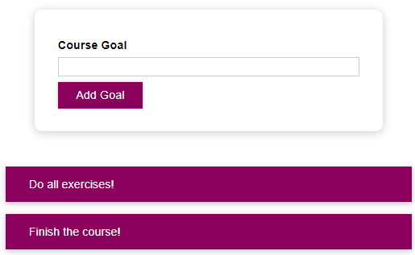

# Styling-React-Components




Styling react components es un proyecto de practica donde se pone a prueba diversas alternativas en javascript para realizar cambio de estilos, ademas se uso la libreria styled-components. Basado en el curso "React - the complete guide (incl hooks, React Router, Redux)" de Academind en Udemy

## Instalación y Ejecución

Debe tener instalado Node, posterior a ello, solo debe ejecutar los siguientes comandos en la consola en el mismo orden.

```
npm install
npm start
```
